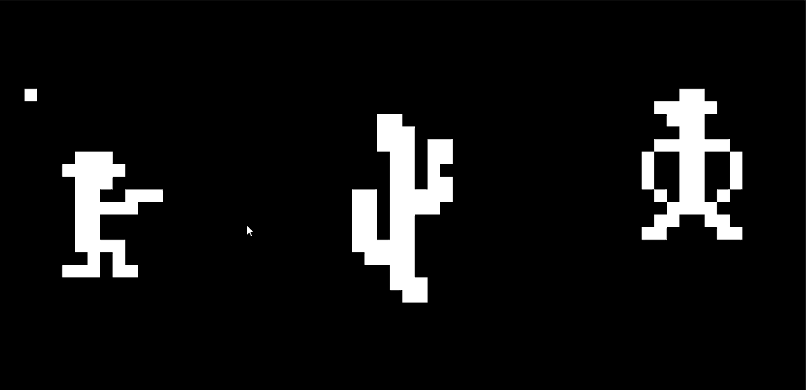

# CHIP-8 Emulator



A simple CHIP-8 interpreter written in C++20, for practice.
Currently using SDL3 as the media platform, but this can be modified easily.

CMAKE should install SDL3 dependency automatically using the FetchContent().
The `CHIP8.exe` and `SDL3.dll` will be automatically moved to the project root on Windows.

## Usage
Run the emulator by passing a CHIP-8 ROM file:
```powershell
CHIP8 path/to/rom.ch8
```

## Not Yet Implemented
- **Debugger/Disassembler:** Real-time inspection of CPU state.
